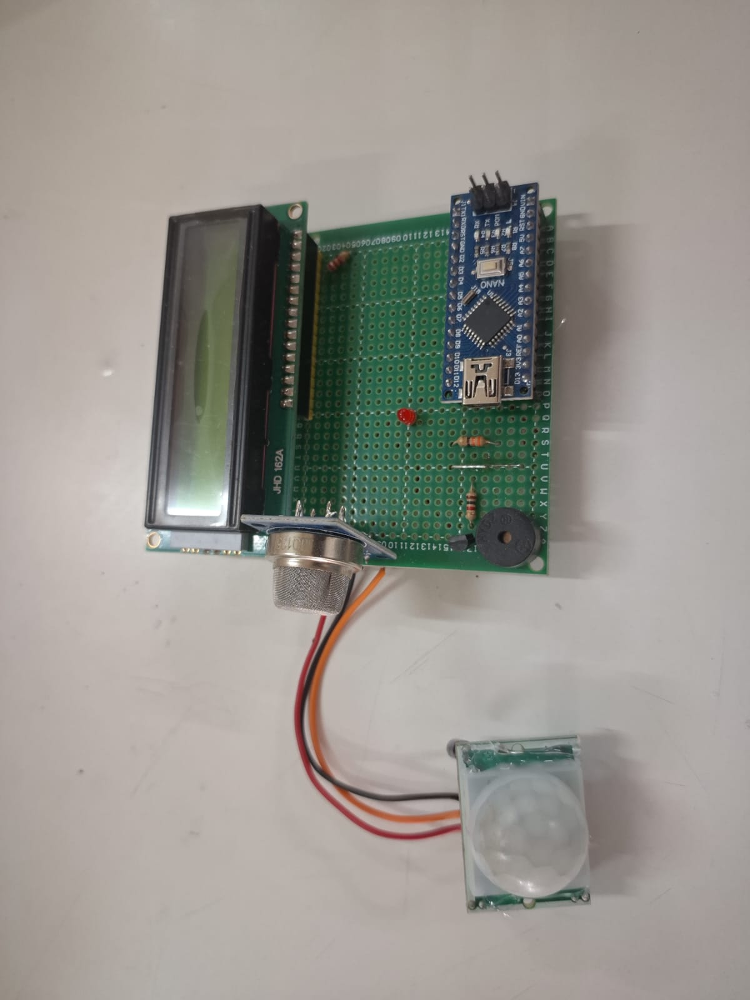

# 🚀 Smart Air Quality Monitoring System

A responsive, real-time IoT solution built with **Arduino Nano** and **PlatformIO**. This system monitors ambient air quality and utilizes "Smart Activation" logic—triggering alerts only when unsafe air levels are detected in the presence of human motion.

## 📖 Overview
Traditional air quality monitors alert continuously when thresholds are crossed. This project introduces a **PIR-based motion detection layer**, ensuring the system is interactive and responsive to its surroundings. 

If the air is unsafe but the room is empty, the system remains in a passive monitoring state. If motion is detected, it enters an active alert state.

### 🔧 Key Highlights
* **Real-time AQI Monitoring:** High-sensitivity detection of CO2, Smoke, and Benzene using the MQ135.
* **Smart Logic Alerts:** Integration of a PIR sensor to trigger the buzzer only when necessary.
* **Live Data Interface:** 16x2 LCD (I2C) for real-time baseline readings.
* **Professional Build:** Developed using **PlatformIO** for better dependency management.

## 🛠 Hardware Requirements

| Component | Description |
| :--- | :--- |
| **Microcontroller** | Arduino Nano (ATmega328P) |
| **Gas Sensor** | MQ135 (Air Quality/Pollution Sensor) |
| **Motion Sensor** | HC-SR501 PIR Sensor |
| **Display** | 16x2 LCD with I2C Backpack |
| **Alert System** | 5V Active Buzzer |

## 📐 Circuit Diagram
Refer to the schematic below for wiring the sensors to the Arduino Nano:

> **Note:** The high-resolution schematic is located in the `/assets` folder.

## 📺 Demonstration

### Live Photos

### Video Demonstration
You can find the video demonstrations in the `assets/` folder:
1. **[Motion Detection & Alert Test](./assets/PIR.mp4)**
2. **[Smoke Detection & Alert Test](./assets/AQI.mp4)**
